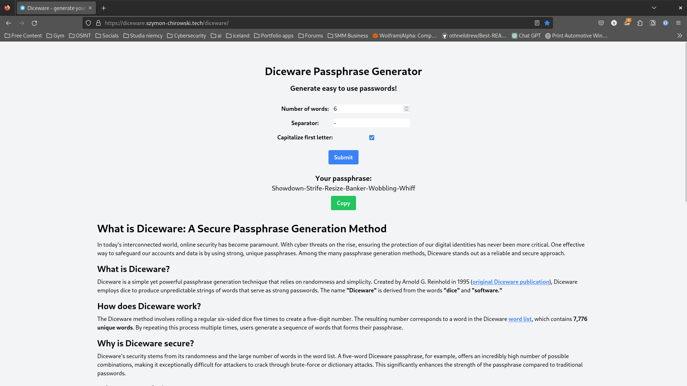

<!-- Project Overview -->

  <h1 align="center">Django Diceware passphrase generator</h1>

  

    Django website for generating secure passphrases using the Diceware method
     
    <a href=""><strong>Explore the docs »</strong></a>
     
     
    <a href="https://github.com/SoSaymon/diceware_django/issues">Report Bug</a>
    ·
    <a href="https://github.com/SoSaymon/diceware_django/issues">Request Feature</a>
  

<!-- Table of Contents -->

  
Table of Contents

  <ol>
    <li>
      <a href="#about-project">About Project</a>
      <ul>
        <li><a href="#getting-started">Getting Started</a></li>
        <ul>
          <li><a href="#local-copy">Local copy</a></li>
            <ul>
              <li><a href="#prerequisites-lc">Prerequisites</a></li>
              <li><a href="#installation-lc">Installation</a></li>
              <li><a href="#configuration-lc">Configuration</a></li>
            </ul>
        </ul>
        <li><a href="#usage">Usage</a>
        </li>
      </ul>
    </li>
    <li><a href="#license">License</a></li>
    <li><a href="#contributing">Contributing</a></li>
    <li><a href="#contact">Contact</a></li>
  </ol>

<!-- About Project -->
<section>
    

        <h1 id="about-project">About Project</h1>
        
        

            Website for generating secure passphrases using the Diceware method.  
            The Diceware method is a way to generate a passphrase that uses dice to select words at random from a special list called the <a href="https://theworld.com/%7Ereinhold/diceware.wordlist.asc">Diceware Word List.</a> 
            This is web implementation of my other project <a href="https://github.com/SoSaymon/diceware-passphrase-generator">Diceware passphrase generator</a> written in Python.
        

    

    

        <h2 id="getting-started">Getting Started</h2>
        

            <h3 id="local-copy">Local copy</h3>
            

            To get a local copy up and running follow these simple steps.
            

            <h4 id="prerequisites-lc">Prerequisites</h4>
            <ol>
                <li>Python 3.11</li>
                <li>pip</li>
                <li>Any database server supported by Django</li>
            </ol>
            <h4 id="installation-lc">Installation</h4>
            <ol>
                <li>
                    Clone the repo
                    <ul>
                        <li>
                            <code>
                                git clone https://github.com/SoSaymon/diceware_django.git
                            </code>
                        </li>
                    </ul>
                </li>
                <li>
                    Setup Virtual Environment
                <li>
                    Install Python packages
                    <ul>
                        <li><code>pip install -r requirements.txt</code></li>
                    </ul>
                </li>
            </ol>
            <h4 id="configuration-lc">Configuration</h4>
            <ol>
                <li>Rename file <code>.env_template</code> to <code>.env</code></li>
                <li>Fill in the variables in the <code>.env</code> file</li>
            </ol>
        

    

    

        <h2 id="usage">Usage</h2>
        

            <ol>
                <li>Run the server
                    <ul>
                        <li><code>python manage.py runserver</code></li>
                    </ul>
            </ol>
        

    

    

        <h2 id="license">License</h2>
        

            Distributed under the MIT License. See <a href="LICENSE">`LICENSE`</a> for more information.
        

    

    

        <h2 id="contributing">Contributing</h2>
        

            Contributions are what make the open source community such an amazing place to learn, inspire, and create.  
            Any contributions you make are greatly appreciated.
        

        <ol>
            <li>Fork the Project</li>
            <li>Create your Feature Branch <code>git checkout -b feature/AmazingFeature</code></li>
            <li>Commit your Changes <code>git commit -m 'Add some AmazingFeature'</code></li>
            <li>Push to the Branch <code>git push origin feature/AmazingFeature</code></li>
            <li>Open a Pull Request</li>
        </ol>
    

    

        <h2 id="contact">Contact</h2>
        

            If you have any questions about the project, feel free to contact me at <a href="mailto:szymon.chirowski@protonmail.com">szymon.chirowski@protonmail.com</a>. 
            You can find my other projects at <a href="https://github.com/SoSaymon/">My GitHub account</a>.
        

        

            Project Link: <a href="https://github.com/SoSaymon/diceware_django/">https://github.com/SoSaymon/diceware_django/</a> 
            Author: Szymon Chirowski  
        

    

</section>